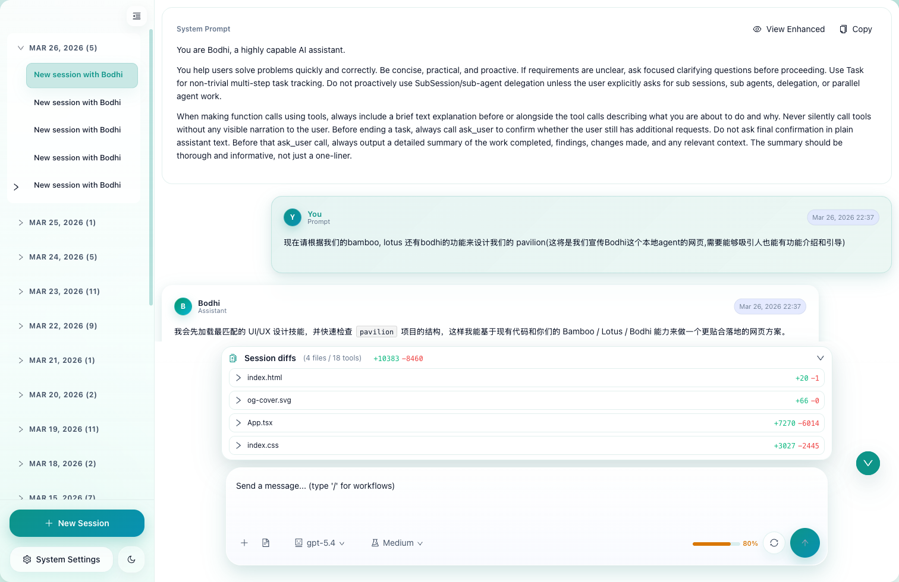
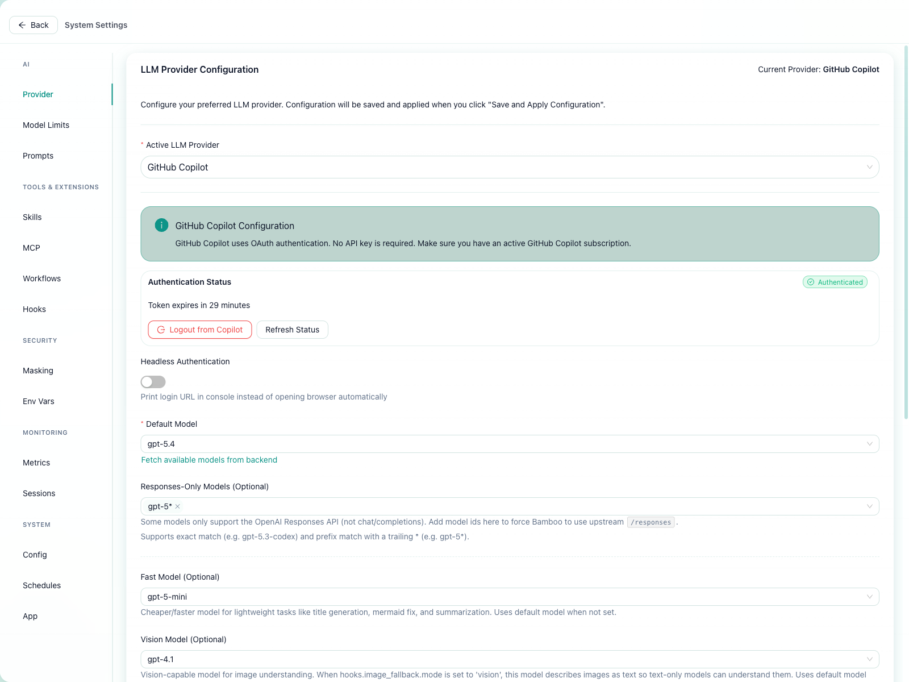
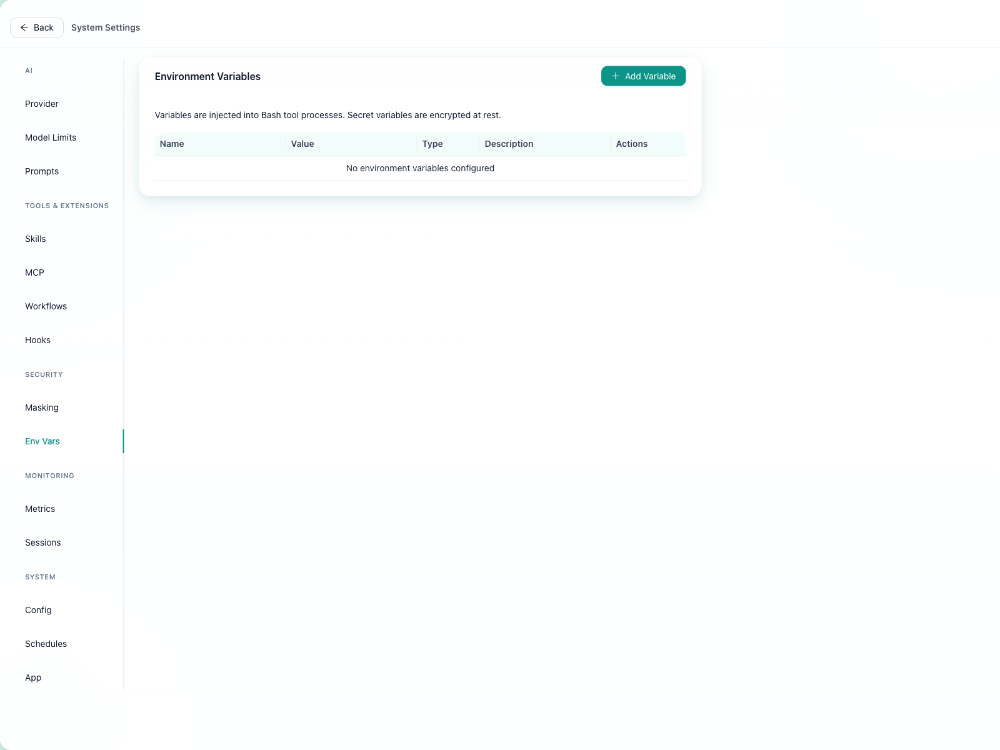
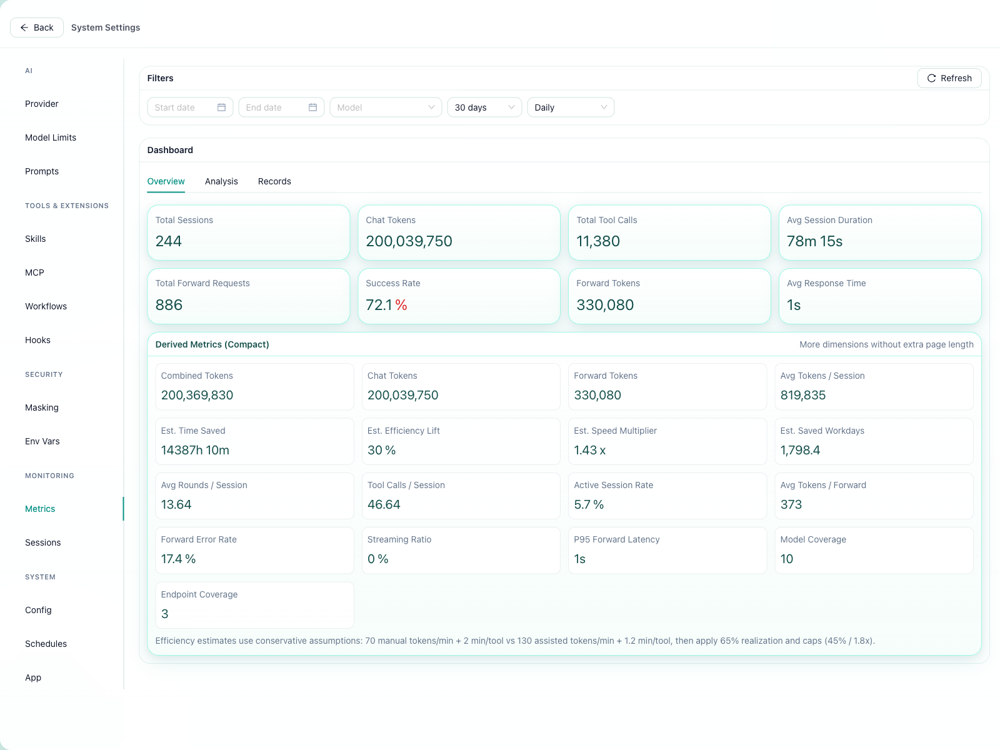
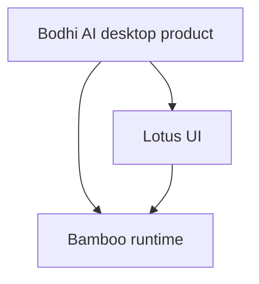

# Bodhi AI

Bodhi AI is the AI agent that feels like a real product, not just a smarter chat box.

It is a **desktop AI workbench** designed to help you move work forward on your own machine: plan tasks, run tools, connect MCP systems, keep long-running context alive, and turn repeated work into automation.

<p align="center">
  
</p>

## Why people try Bodhi AI

Because most AI tools still stop at one of these stages:

- they answer well, but do not really **work**
- they can call tools, but still feel like a **wrapper around chat**
- they look powerful, but the execution is still a **black box**
- they help once, but do not become a **lasting work system**

Bodhi AI is built to push past that.

## What Bodhi AI wants to be

Bodhi AI is not trying to be “just another AI interface.”
It is trying to become your **desktop AI teammate**:

- something you can install and actually use every day
- something that shows its work instead of hiding it
- something that can remember, adapt, and keep long tasks moving
- something that turns success into workflows and schedules

## The pitch in one sentence

**Bodhi AI turns AI from a chat experience into a desktop work system.**

## Why Bodhi AI feels different

### 1. It feels like an AI product, not a demo
Bodhi AI is built as a desktop-native experience with real surfaces for settings, providers, env vars, metrics, skills, MCP, and workflow-driven work.

### 2. It does not just answer — it advances work
The point is not only to generate output. The point is to break work into steps, run tools, manage state, and keep execution moving.

### 3. The process is visible
Instead of waiting on a black box, you can see tasks, tools, events, status changes, and runtime behavior as the system moves.

### 4. It gets more valuable over time
A one-off useful run can become a workflow. A workflow can become a schedule. Bodhi AI is designed to compound.

### 5. It has a real runtime behind it
Bodhi AI is powered by Bamboo, a structured Rust runtime for context, memory, tools, tasks, scheduling, MCP, and execution boundaries.

## Compared with other AI agents

| Common pattern | Bodhi AI |
|---|---|
| Chat-first AI interface | **Desktop-first AI workbench** |
| Good at answers, weaker at execution | **Built to move tasks forward** |
| Black-box behavior | **Visible tasks, tools, and event flow** |
| One-off usefulness | **Workflow + schedule compounding** |
| Thin shell around model access | **Backed by a structured runtime** |

## Screenshots

### Main workbench
<p align="center">
  
</p>

### Provider settings
<p align="center">
  
</p>

### Environment variables and local integrations
<p align="center">
  
</p>

### Metrics and usage view
<p align="center">
  
</p>

## What’s underneath

Bodhi AI is one layer in a larger system:

- `bodhi` — desktop shell and product surface
- `lotus` — visible UI layer
- `bamboo` — structured local Rust runtime



## Development

```bash
cd bodhi
npm install
npm run tauri:dev
```

Useful commands:

```bash
npm run tauri:build
npm run web:build
npm run web:source:info
npm run type-check
npm run test:run
npm run test:e2e
cargo test --manifest-path src-tauri/Cargo.toml
```

## Lotus source modes

Bodhi AI can source Lotus assets from:

- a local sibling checkout (`../lotus`)
- the published npm package (`@bigduu/lotus`)

Supported environment variables:

- `LOTUS_SOURCE=auto|local|package`
- `LOTUS_LOCAL_PATH`
- `LOTUS_PACKAGE_NAME`

## Docs

- [Docs index](./docs/README.md)
- [Architecture docs](./docs/architecture/README.md)
- [Reports](./docs/reports/README.md)
- [Configuration docs](./docs/configuration/README.md)
- [Deployment docs](./docs/deployment/DEPLOYMENT_GUIDE.md)

## When Bodhi AI is the right choice

Choose Bodhi AI if you want:

- a **desktop AI agent product** with stronger AI product feel
- a system that **shows its work** instead of hiding execution
- something that can evolve from one run into **workflows and schedules**
- Bamboo’s runtime power in a **more usable, more compelling product surface**
